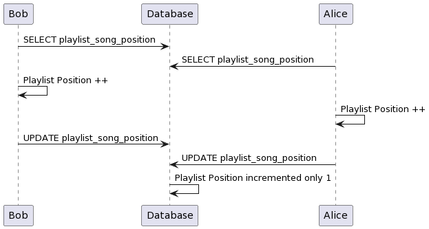
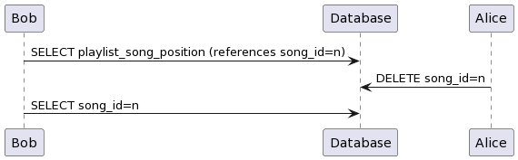
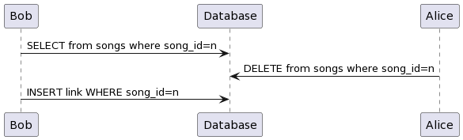

# Concurrency
## Case 1 - Lost Update
Multiple instances of the same user attempts to listen to the same playlist.

This issue arrises since changes to playlist position are not idempotent.

We serialized this transaction to prevent this. Write speed is not super important as we do not expect many instances of a user to access the service.

## Case 2 - Non-repeatable Read
A user attempts to play a song via Play Playlist while another user deletes the song from the service.

This would be prevented by changing the isolation level to Repeatable Read but due to Case 1 above, the transaction is Serialiable anyways.

## Case 3 - Phantom Read
A similar situation to the one above. A user attempts to add a link to a song which does not exist while another user creates a song that receives the previously non-existant song id.

This is handled when the isolation level for the add_link transaction is configured to Serializable. 

